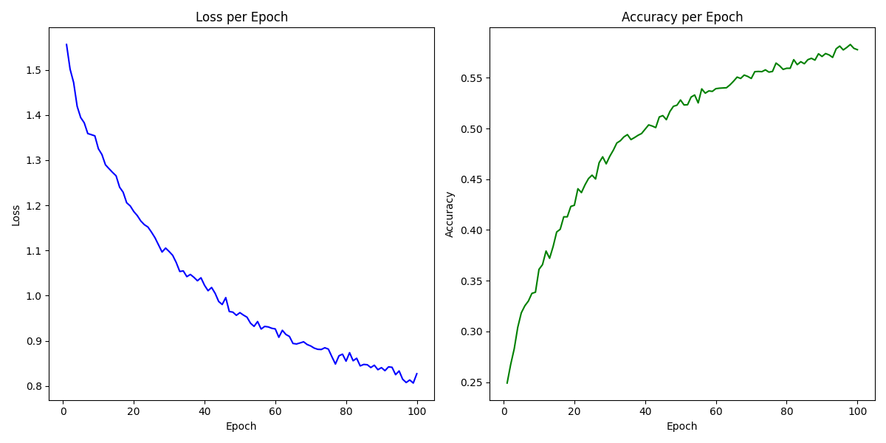

# 🧠 Graph Classification under Noisy Labels (ogbg-ppa Subset)

This repository contains our solution for a graph classification task with **noisy labels**, developed as part of a hackathon in the Deep Learning Course. We tackled the challenge by training robust Graph Neural Networks (GNNs) on noisy versions of the [OGB ogbg-ppa](https://ogb.stanford.edu/docs/graphprop/) dataset.

---

## 👥 Contributors

| Name          | Email                  |
|---------------|------------------------|
| Angelo Gianfelice  | gianfelice.1851260@studenti.uniroma1.it |
| Stefano Previti    | previti.2151985@studenti.uniroma1.it |


## 📌 Problem Statement

Real-world data often contains incorrect or **noisy labels**, making supervised learning models prone to overfitting and generalization issues. Our goal was to design and evaluate noise-robust GNN models capable of accurate classification under such label corruptions.

---

## 📚 Dataset Overview

The original **ogbg-ppa** dataset:
- Contains graphs representing protein-protein associations.
- Has **37 classes** for classification.
- Widely used for benchmarking graph classification.

### 🧪 Modified Datasets (A–D)

For this challenge:
- **6 classes** were selected at random from the 37 original ones.
- **40%** of the data was randomly sampled to form the training set.
- **Noise was added** to the labels:
  - **Symmetric noise**: Labels are randomly flipped to any other class.
  - **Asymmetric noise**: Labels are flipped to *specific* incorrect classes based on semantic proximity.

We trained four different modeal for each of our datasets

---

## 🏗️ Model Architecture

All models are built upon **GIN-Virtual** (Graph Isomorphism Network with a virtual node), known for its strong expressiveness in graph classification tasks

### GNN Components
- **Backbone**: `GIN`
- **Virtual Node**: Summarizes global graph context
- **Pooling**: Mean or attention-based, depending on dataset
- **Embedding Dimensions**: Tuned per dataset (256–1024)
- **Depth**: 3–5 layers
- **Dropout**: 40–50%: for regularization

### Co-Teaching Paradigm [https://arxiv.org/abs/1804.06872v3](https://arxiv.org/abs/1804.06872v3)
In the context of noise robustness, the **co-teaching paradigm** is a training strategy for deep learning models where two neural networks are trained simultaneously and collaboratively to combat label noise. 
Each model selects a small subset of training instances with the lowest loss (assumed to be clean) and teaches it to the other model. This mutual update helps avoid overfitting to noisy labels, as each model provides a form of noise filtering for the other.
**Key idea**: Small-loss instances are more likely to be correctly labeled, so exchanging these helps both models learn robustly despite noisy data.

<p align="center">
  
</p>

- Note that in our implementation we chose one of the two model (***Teacher Model***) and use it only at training time to help the other model (***Student Model***), which is the one that we ultimately used for validation/testing.
Altough this requires much more training time, we reached good results with this approach (especially for dataset B)

### Robost Loss Funtions
We used 3 different losses in our best models:
- **NoisyCrossEntroy_OLD**: the one already given
```python  
class NoisyCrossEntropyLoss_OLD(nn.Module): 
    def __init__(self, p_noisy=0.2): 
        super().__init__() 
        self.p = p_noisy 
        self.ce = torch.nn.CrossEntropyLoss(reduction='none')

    def forward(self, logits, targets):
        losses = self.ce(logits, targets)
        weights = (1 - self.p) + self.p * (1 - torch.nn.functional.one_hot(targets, num_classes=logits.size(1)).float().sum(dim=1))
        return (losses * weights).mean()
```
- **NoisyCrossEntroy_NEW**: Our improved implementation of the Noisy Cross Entropy, which adaptively weights the loss using the model's own uncertainty (via softmax confidence), rather than a static one-hot sum 
```python
  class NoisyCrossEntropyLoss_NEW(nn.Module):
    def __init__(self, p_noisy=0.2):
        super().__init__()
        self.p_noisy = p_noisy
        self.ce = nn.CrossEntropyLoss(reduction='none')

    def forward(self, logits, targets):
        losses = self.ce(logits, targets)
        probs = F.softmax(logits, dim=1)
        true_class_probs = probs[torch.arange(len(targets)), targets]
        uncertainty = 1.0 - true_class_probs.detach()
        weights = (1.0 - self.p_noisy) + self.p_noisy * uncertainty
        weighted_loss = (losses * weights).mean()
        return weighted_loss
```
- **Co-Teachingloss**: Which follows the Co-teaching paradigm described above
```python
  class co_teaching_loss(torch.nn.Module):
    def __init__(self, forget_rate=0.3, label_smoothing=0.1):
        super().__init__()
        self.forget_rate = forget_rate
        self.ce = torch.nn.CrossEntropyLoss(reduction='none', label_smoothing=label_smoothing)

    def forward(self, logits1, logits2, target):
        loss1 = self.ce(logits1, target)
        loss2 = self.ce(logits2, target)

        # Sort the samples by loss value (ascending)
        ind1_sorted = torch.argsort(loss1)
        ind2_sorted = torch.argsort(loss2)

        # Calculate number of samples to remember
        remember_rate = 1 - self.forget_rate
        num_remember = int(remember_rate * len(loss1))

        # Select indices of the smallest losses (i.e., most confident predictions)
        ind1_update = ind1_sorted[:num_remember]
        ind2_update = ind2_sorted[:num_remember]

        # Exchange and compute updated loss
        loss1_update = self.ce(logits1[ind2_update], target[ind2_update])
        loss2_update = self.ce(logits2[ind1_update], target[ind1_update])

        return torch.mean(loss1_update), torch.mean(loss2_update)
  ```
---
All the best model have been trained with this configuration:
## 🔧 Global Hyperparameters

```python
config = {
    "seed": 42,
    "num_checkpoints": 10,
    "gnn": "gin-virtual",
    "batch_size": 32,
    "forget_rate": 0.3,       # used in Co-teaching
    "label_smoothing": 0.1,   # used in Co-teaching
    "noise_prob": 0.2,        # used in noisy losses
}
```

## 🧪 Dataset-Specific Strategies

After numerous trials we finally reached the best results with this configs (our best models for each dataset):
### 🔹 Dataset A
- **Loss Function**: `Noisy New`
- **Architecture**:
  - Layers: 3
  - Embedding: 512
  - Graph Pooling: Mean
- **Notes**: Performed best with a more balanced and regularized setup.
  


---

### 🔹 Dataset B
- **Loss Function**: `Co-teaching`
- **Forget Rate**: 0.3
- **Label Smoothing: 0.1
- **Architecture**:
  - Layers: 5
  - Embedding: 300
  - Graph Pooling: Mean
- **Notes**: Co-teaching helped discard high-noise labels by filtering out high-loss samples across two models



---

### 🔹 Dataset C
- **Loss Function**: `Noisy Old`
- **Architecture**:
  - Layers: 3
  - Embedding: 1024
  - Graph Pooling: Attention
- **Notes**: Larger embeddings and attention pooling helped with capturing patterns in high-noise data.
  


---

### 🔹 Dataset D
- **Loss Function**: `Noisy New`
- **Architecture**:
  - Layers: 5
  - Embedding: 256
  - Graph Pooling: Mean
- **Notes**: Compact model with robust loss was effective for this dataset.
  


---

# 📦 Installation & Usage

### Required dependencies
 The file 'requirements.txt' contains the python version and all the python packages needed to run the code
 
### Clone the repository

```bash
git clone https://github.com/AngeloGianfelice/DL_Hackaton
```

### Running the code
To run the project just simple execute the following script:

```bash
python main.py --test_path <path_to_test.json.gz> --train_path <optional_path_to_train.json.gz>
```
- if '--train_path' is provided, the script must train the model using the specified ***train.json.gz*** file.
- if --train_path is not provided, the script should only generate predictions using the pre-trained model checkpoints provided. The output will be a CSV file named as ***testset_<foldername>.csv*** where <foldername> corresponds to the dataset folder name (e.g., A, B, C, or D).
 
